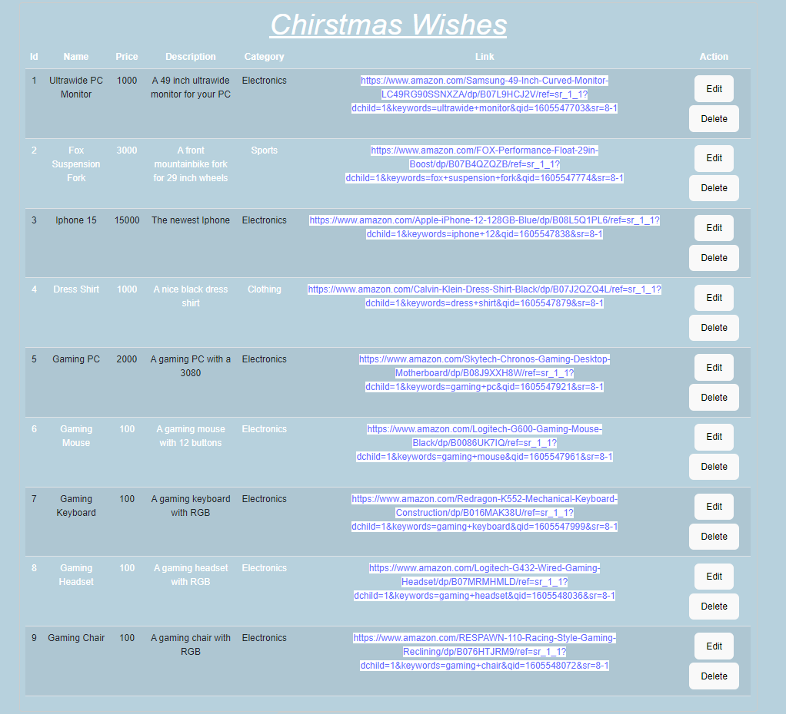
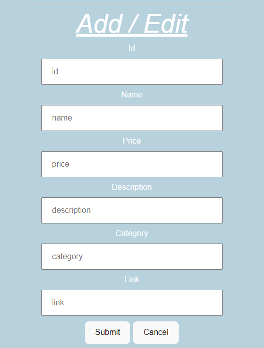

# Project Description
My app idea was to make a quick single page app that handles all of your christmas wishes for you. If youre anything like me, its impossible to first of all think of something and then to remember it when your family asks what you wish for. This way it is easy to track what you want/the price/where to get etc.  
  
There were some extra functionality i had hoped to add, a way to track the presents you had already bought for other peopel but i found it tough to get it to work with only the one "api" and near impossible to seperate the two once saved.   
  
If time allowed I also had hoped to find a better way to display it so the add/edit option was only visible when needed (and displayed to the side of the data table)  
  
Nevertheless, the core functionality is present, below are some images showing how it looks running. I spent a few hours on styling but this was as far as i could get (pretty rusty in regards to html/css)

## The Data Table:

## The Add/Edit Form:

